# TimeDraft — Architecture & How It Works

As of 2026-10-04. Exported from the shared design doc; the 13 diagrams are the SVG files next to this one in `docs/`.

## Overview

TimeDraft drafts one attorney's billable day: it reads the day's emails, calendar events, document edits and calls, and proposes time entries for the attorney to approve.

Each activity is matched to a client matter, then grouped into entries billed in tenths of an hour (0.1 h), with UTBMS task and activity codes and a specific narrative. Every entry is checked against that client's billing guidelines. The attorney approves, edits or rejects each entry on a review screen, and approved time exports as LEDES 1998B.

The core split is **Claude judges, code counts.** Claude places activities the rules can't, groups them, picks codes and writes narratives. Durations, rounding, totals, guideline checks and exports are plain code, and Claude never returns a duration.

Three more rules shape the design:

- **Don't guess, queue it.** An uncertain match waits for the attorney; it is never auto-assigned.
- **History can't be rewritten.** Entry changes, queue placements, day loads, match runs and exports each write an audit row, and the database rejects edits to the audit table.
- **Measured, not asserted.** Twelve synthetic days with answer keys (8 dev, 4 holdout) score the pipeline.

All data is synthetic: fictional names, `.example` domains and 555-01xx phone numbers.

## Architecture

Three callers drive one body of server code, which reaches Claude, Postgres and an optional Go checker through narrow doors.

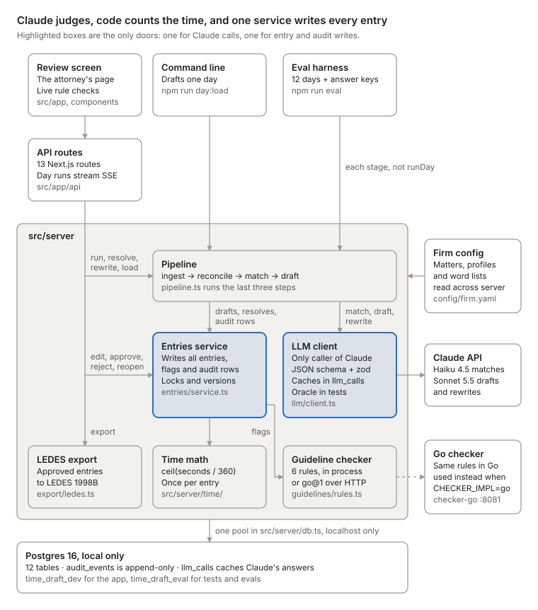

Read it top down: the screen (through the API routes), the CLI and the evals all drive the same server code. Claude is reached only through the LLM client, entries and audit rows are written only by the entries service, and all state lives in local Postgres.

## Repository layout

TimeDraft is one TypeScript repo (Next.js app, server code, scripts and evals) plus a Go service in `checker-go/` that uses only the standard library. Run every command from the repo root, because config, migrations, fixtures and tests are read relative to it.

| Path | What lives there |
| --- | --- |
| `config/firm.yaml` | The synthetic firm: attorney, matters, contacts, guideline profiles and word lists |
| `db/migrations/001_init.sql` | The schema: 12 tables, indexes and the append-only audit trigger |
| `db/seed/utbms.sql` | The 40 UTBMS codes |
| `src/app/` | Next.js App Router: the home page, the `days/[dayId]` review page and 13 API routes |
| `src/components/` | Seven React components for the review screen |
| `src/lib/` | Shared code: `config.ts` (env and firm config), `schemas.ts` (zod), `types.ts`, `utbms.ts` |
| `src/server/pipeline.ts` | Runs a day through reconcile, match and draft; also the resolve and rewrite helpers |
| `src/server/ingest/` | Turns a day's sources into activities, estimates email time, merges calls into meetings |
| `src/server/match/` | The rule matcher, Claude's match items and the acceptance gate |
| `src/server/draft/` | Per-matter drafting, validation and repair |
| `src/server/time/` | Interval math and rounding |
| `src/server/guidelines/` | The TypeScript rules and the client for the Go checker |
| `src/server/entries/service.ts` | The single writer of entries and flags, plus the screen's read models |
| `src/server/export/ledes.ts` | The LEDES 1998B export |
| `src/server/llm/` | The Claude client, the response cache and the versioned prompts |
| `src/server/db.ts` | Connections, transactions, migrate, seed, reset and the local-only guard |
| `scripts/` | `db.ts` (migrate, seed, reset) and `load-day.ts` (draft a day in the terminal) |
| `contracts/` | `checker.schema.json` and the golden fixtures shared by TypeScript and Go |
| `checker-go/` | The Go checker service and its tests |
| `evals/` | The generator, 12 days, 12 answer keys, the runner and the scorer; reports go to `evals/reports/` |
| `tests/` | 10 Vitest files with 119 test cases |

The stack is Next.js 16, React 19, strict TypeScript 5.9, zod 4, `pg`, `@anthropic-ai/sdk`, Tailwind 4 and Vitest, on Postgres 16. The Go checker targets Go 1.22 with no third-party modules.

## How a day flows end to end

A day moves through four steps (ingest, reconcile, match, draft), and each one saves its work before the next starts. `days.status` says how far a day got, or `failed` after an error. `runDay` in `src/server/pipeline.ts` runs the last three; ingest happens when the day is loaded.

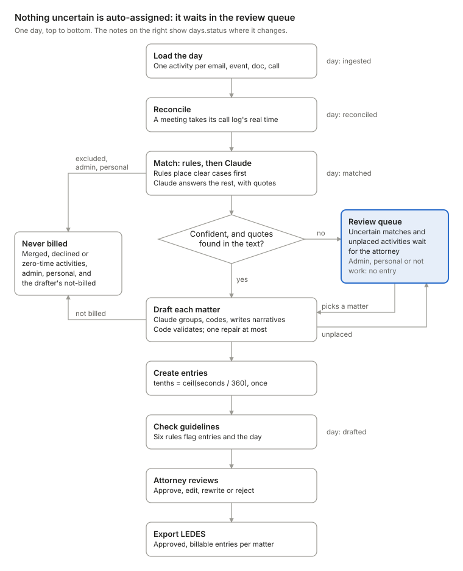

Rules and Claude both place activities, but only confident answers with real quotes go straight to drafting. Everything uncertain, including what the drafter can't place, waits for the attorney.

### Stages

| Step | Function | Runs when | Writes | Status after |
| --- | --- | --- | --- | --- |
| Ingest | `ingestFixture` in `src/server/ingest/normalize.ts` | The day isn't loaded yet | One `days` row, one `activities` row per email, event, doc session or call, one audit row | `ingested` |
| Reconcile | `reconcileDay` in `src/server/ingest/reconcile.ts` | The day has no `activity_matches` rows | A calendar event takes its call log's real time; the call is marked merged | `reconciled` |
| Match | `runMatching` in `src/server/match/index.ts` | The day has no `activity_matches` rows | One `activity_matches` row per activity, one audit row | `matched` |
| Draft | `draftDay` in `src/server/draft/index.ts` | Every run | Entries, their sources and flags, one audit row per entry | `drafted` |

Any error inside `runDay` sets the status to `failed`, sends an `error` event and rethrows. A re-run works out what is left from the saved rows, not from the status.

### Two ways into the review queue

An activity waits for the attorney, with `activity_matches.status = 'needs_review'`, in two cases:

- **Matching** can't place it with confidence: Claude's answer fails the acceptance gate (see Matching).
- **Drafting** leaves it out of every entry. It returns to the queue tagged `drafter_unplaced`.

Merged calls, declined events and zero-second activities go to `ignored` instead, and admin or personal items are placed but never drafted. The attorney places a queued item with `POST /api/activities/[id]/resolve`; picking a matter drafts the new work straight away.

### Progress on screen

`POST /api/days/[id]/run` streams server-sent events, one `data: <json>` frame each. The day page reads them with `fetch` and a stream reader.

| Event | Sent | On screen |
| --- | --- | --- |
| `stage` | Before each stage | "Merging calendar events with their call logs", "Matching activities to matters", "Drafting entries" |
| `match_summary` | After matching | "N activities placed, M need a matter" |
| `review_item` | After matching, once per queued activity | Adds it to the queue |
| `entry` | After each matter's entries commit | Adds the entry |
| `done`, `error` | At the end | The error message, on failure |

When the stream closes, the page reloads the day from `GET /api/days/[id]`. Guideline flags first appear on that reload, because they are computed after every matter is drafted.

### Who starts a run

- The review screen runs a day when it opens, unless it is already `drafted`.
- `npm run day:load -- day-03` calls the same `runDay` and prints the drafted day.
- `npm run eval` calls the four steps directly, without `runDay`.

### Running a day again

A re-run resumes and never duplicates entries. Reconcile and match run only while the day has no matches, and reconcile skips meetings it already merged. Draft picks only activities that are in no entry, and a unique index on `entry_sources(activity_id)` backs this up. The run route also refuses a second concurrent run of the same day, but only within one server process.

## Data model

TimeDraft keeps its state in 12 Postgres tables defined in `db/migrations/001_init.sql`, plus `schema_migrations`, which `src/server/db.ts` creates. Each activity gets one match, matched activities feed time entries, and approved entries feed LEDES exports.

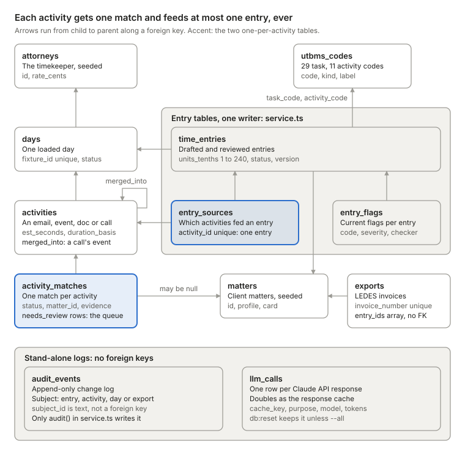

Follow one activity: its single `activity_matches` row may place it on a matter, and `entry_sources` lets it feed one entry, which hangs off a day, a matter and two UTBMS codes. `audit_events` and `llm_calls` have no foreign keys; an audit row names its subject by type and id.

### Tables

| Table | Holds | Key columns | References |
| --- | --- | --- | --- |
| `attorneys` | The timekeeper, seeded | `id` (`DW`), `classification`, `rate_cents` | none |
| `matters` | Client matters, seeded from `config/firm.yaml` | `id` (`M-1001`), `client_matter_id`, `ledes_client_id`, `profile`, `card` | none |
| `utbms_codes` | 29 task and 11 activity codes | `code`, `kind`, `label` | none |
| `days` | One loaded day | `fixture_id` (unique), `work_date`, `status` | `attorneys` |
| `activities` | One email, calendar event, doc session or call | `source`, `started_at`, `est_seconds`, `duration_basis`, `participants`, `body`, `meta` | `days`; `merged_into` points at another activity |
| `activity_matches` | The match decision for one activity | `status`, `category`, `method`, `confidence`, `evidence`, `suggestion` | `activities`, `matters` |
| `time_entries` | Drafted and reviewed entries | `units_tenths` (1–240), `raw_seconds`, task and activity codes, `narrative`, `thin_context`, `status`, `version` | `days`, `matters`, `utbms_codes` |
| `entry_sources` | Which activities fed an entry, and their seconds | `seconds`; unique on `activity_id` | `time_entries`, `activities` |
| `entry_flags` | Current flags per entry: guideline flags plus ungrounded-name warnings | `code`, `severity`, `message`, `checker`, `override_reason` | `time_entries` |
| `audit_events` | Append-only change log | `subject_type`, `subject_id`, `version`, `actor`, `action`, `before`, `after`, `reason` | none |
| `llm_calls` | Claude call log and response cache | `purpose`, `model`, `prompt_version`, `cache_key`, `request`, `response`, token counts, `latency_ms` | none |
| `exports` | LEDES invoices | `invoice_number` (unique), `entry_ids`, `total_cents`, `file_text` | `matters` |

### Status values

| Column | Values |
| --- | --- |
| `days.status` | `ingested`, `reconciled`, `matched`, `drafted`, or `failed` |
| `activity_matches.status` | `auto`, `needs_review`, `resolved`, `ignored` |
| `activity_matches.category` | `billable`, `admin`, `personal`, `unknown` |
| `activity_matches.method` | `rule`, `llm`, `attorney` |
| `activities.duration_basis` | `exact`, `scheduled`, `measured`, `estimated`, `none` |
| `time_entries.status` | `draft`, `approved`, `rejected` |
| `entry_flags.severity` | `block`, `warn` |

### Storage rules

- Durations are whole seconds in `integer` columns. Billed time is the `smallint` `units_tenths`, checked to 1–240.
- Money is integer cents: `attorneys.rate_cents` and `exports.total_cents`.
- The unique index on `entry_sources(activity_id)` lets an activity feed one entry, ever. Rejecting an entry does not free its activities.
- Trigger `audit_events_no_change` makes `audit_events` append-only by raising on any UPDATE or DELETE.
- Day-level flags such as `DAILY_TOTAL` are never stored; they are recomputed on each read.

### Connections

`src/server/db.ts` is the only file that opens connections. `assertLocal` accepts only `localhost`, `127.0.0.1` or the IPv6 loopback `[::1]`, and throws `Refusing to use database host "…"` for any other host. `getPool` keeps one pool (6 connections) per database URL, and `withTx` wraps work in `BEGIN` and `COMMIT`, rolling back on any error.

`npm run db:reset` truncates every app table except `utbms_codes`, `audit_events` included, and reseeds. It keeps the `llm_calls` cache unless run as `db:reset -- --all`, and the UTBMS seed skips codes that already exist.

### Migrations

`migrate` applies each new `.sql` file in `db/migrations` once, in name order, in its own transaction, and records it in `schema_migrations`. Editing `001_init.sql` changes nothing on an existing database, even after `db:reset`, so a schema change needs a new numbered file. There are no down migrations. Evals and tests migrate the eval database themselves; the dev database needs `npm run db:migrate`.

## Claude integration

Every Claude call goes through one function, `callStructured` in `src/server/llm/client.ts`, the only file that imports `@anthropic-ai/sdk`. It replays cached answers, asks for JSON that fits a schema, logs every response to `llm_calls`, and validates the result with zod.

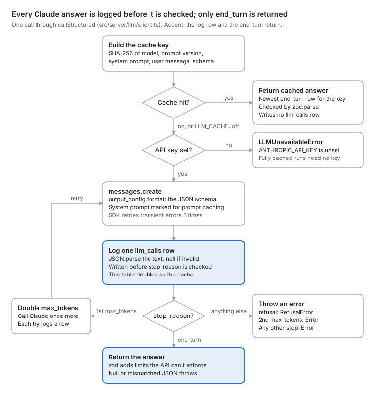

A cache hit is parsed and returned without writing a row. On a miss, every reply is logged to `llm_calls` before its stop reason is checked, and only an `end_turn` reply is parsed and returned.

### One call, step by step

1. Hash the request: `cache_key` is the SHA-256 of model, prompt version, system prompt, user message and JSON schema (`src/server/llm/cache.ts`).
2. Unless `LLM_CACHE=off`, return the newest cached response for that key that ended with `end_turn`, after `zod.parse`. A fully cached run needs no API key.
3. On a miss with no `ANTHROPIC_API_KEY`, throw `LLMUnavailableError`.
4. Call `messages.create` with the system prompt marked for prompt caching and `output_config: { format: { type: 'json_schema', schema } }`. The SDK retries connection errors and 408, 409, 429 and 5xx responses up to 3 times.
5. Parse the text as JSON and insert one `llm_calls` row.
6. Check `stop_reason`: `refusal` throws `RefusalError`, a first `max_tokens` doubles the budget and retries once, and any other stop except `end_turn` throws.
7. Return `zod.parse(parsed)`.

### Tasks, models and budgets

| Task | Caller | Model env (default) | Prompt | `max_tokens` |
| --- | --- | --- | --- | --- |
| Match | `runMatching`, one batch per day for activities the rules could not place | `MODEL_MATCH` (`claude-haiku-4-5-20251001`) | `match.v1` | 600 + 250 per activity |
| Draft | `draftMatter`, one call per matter with pending work in each `draftDay` run, matters in parallel | `MODEL_DRAFT` (`claude-sonnet-5-5`) | `draft.v1` | 800 + 300 per activity |
| Repair | `draftMatter`, once, when `validateDraft` finds errors | `MODEL_DRAFT` | `draft.v1` plus the errors and the previous answer | 800 + 300 per activity |
| Rewrite | `suggestRewrite` in `src/server/pipeline.ts` | `MODEL_DRAFT` | `rewrite.v1` | 700 |

Prompts live in `src/server/llm/prompts/`. Each one puts the stable context in the system prompt and the work in the user message, as JSON.

| Prompt | System prompt | User message |
| --- | --- | --- |
| `match.v1` | Every matter card, the admin senders and phones, the colleagues | The day's unplaced activities, with up to four neighbours each |
| `draft.v1` | One matter card, that client's guidelines, the allowed UTBMS codes | The matter's pending activities; a repair adds the errors and the previous answer |
| `rewrite.v1` | One matter card and the narrative rules | One entry's narrative, codes, flag messages, sources and the attorney's hint |

### Two layers of validation

The JSON schemas, written by hand in each prompt file, fix the shape and the enums (matter ids, UTBMS codes) with `additionalProperties: false`. The zod schemas in `src/lib/schemas.ts` add what the API can't enforce: confidence from 0 to 1, at most 5 quotes, narratives up to 400 characters. No output schema has a time field, so Claude cannot return a duration.

### `llm_calls`: log and cache

Each API response writes one row: purpose, model, prompt version, cache key, request, parsed response, stop reason, input and output tokens, and latency. Cache hits write nothing. `npm run db:reset` keeps the table, `db:reset -- --all` clears it, and the dev and eval databases keep separate caches.

### Prompt caching at Anthropic

Separately, the system block carries `cache_control: { type: 'ephemeral' }`, so Anthropic keeps that prefix for 5 minutes and every hit restarts the clock. A prefix caches only from 4,096 tokens on Haiku 4.5 and 512 on Sonnet 5.5. `llm_calls` does not store `cache_read_input_tokens`, so whether the match prompt is long enough to cache is unmeasured.

### Oracle mode

`LLM_MODE=oracle` swaps in `oracleLLM` from `evals/score.ts`, which answers match, draft and rewrite from the answer keys. It never calls Claude and writes no `llm_calls` rows. Its output is labelled in the eval report header, the CLI output, the page footer and `prompt_version = 'oracle'` on entries, but nothing stops an oracle run on the holdout split.

## Matching and the review queue

Every activity gets one `activity_matches` row: placed by rules, placed by Claude, or queued for the attorney. Rules place an activity on a matter alone only when one matter scores 0.85 or more and leads the next by 0.3. Rules also settle merged calls, declined events, zero-second activities and clear personal or admin items. Everything else goes to Claude in one batched call per day, and Claude's answer counts only if it passes a four-part gate.

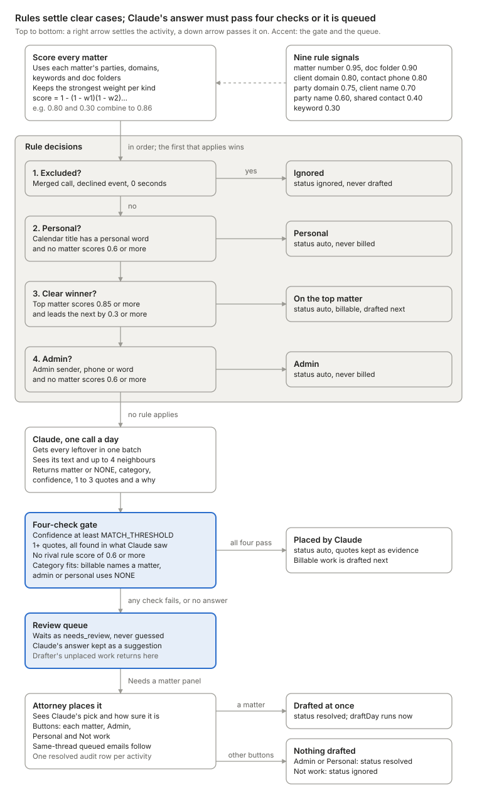

Each activity falls down the ladder until something settles it. Only what no rule settles reaches Claude, and only an answer that passes all four checks is placed without a human.

### Rule signals

`src/server/match/rules.ts` scores each activity against every matter, using the parties, domains, keywords and folders in `config/firm.yaml`.

| Signal | Weight | Fires when |
| --- | --- | --- |
| `matter_number` | 0.95 | The text has the matter number, such as `M-1001` |
| `doc_folder` | 0.90 | A doc's path starts with one of the matter's folders |
| `client_domain` | 0.80 | A participant's email domain is the client's |
| `contact_phone` | 0.80 | A participant is a party's phone number |
| `party_domain` | 0.75 | A participant matches the domain or email of a party who is not the client |
| `client_name` | 0.70 | The text names the client or an alias |
| `party_name` | 0.60 | The text names a party or an alias |
| `shared_contact` | 0.40 | A participant is a shared contact listed on this matter |
| `keyword` | 0.30 | The text has one of the matter's keywords |

A matter's score combines the strongest weight of each kind as 1 − (1 − w1)(1 − w2)…, so repeats of one kind add nothing. A client domain alone scores 0.80; add one keyword and it scores 0.86.

### Rule decisions

`ruleDecision` takes the first outcome that applies:

1. **Excluded**, stored as `ignored`: a call merged into a meeting, a declined event, or zero seconds.
2. **Personal**: a calendar title with a personal word, when no matter scores 0.6.
3. **Auto**: the top score is at least 0.85 and leads the runner-up by at least 0.3. A tie never auto-places.
4. **Admin**: an admin sender, phone or word, when no matter scores 0.6.
5. **Claude**: everything else.

### Claude's matcher

All leftovers go in one request using `MODEL_MATCH` and prompt `match.v1`. Each item carries a ref, the source, the local time, participants, text up to 700 characters and up to four neighbours from the same thread or within 30 minutes. The system prompt holds every matter card, the admin senders and the firm's colleagues.

Claude returns a `matter_id` or `NONE`, a category, a confidence, verbatim quotes (the prompt asks for one to three; zod accepts up to five) and a one-line why. The prompt reserves 0.9 and above for text that names the matter, a party, a contact or a unique issue, and asks for under 0.6 when two matters fit.

### The acceptance gate

`decide` in `src/server/match/index.ts` accepts Claude's answer only when all four checks pass:

| Check | Passes when |
| --- | --- |
| Confidence | At least `MATCH_THRESHOLD` (default 0.8) |
| Quotes | At least one quote, and every quote passes `quoteIsReal` |
| No rival rule | No other matter has a rule score of 0.6 or more |
| Category fits | `billable` names a matter; `admin` or `personal` uses `NONE` |

`quoteIsReal` in `src/server/match/llm.ts` lower-cases, strips quote marks and collapses spaces on both sides. The quote must then be 3+ characters and appear in the activity's text, participants or neighbours. A failed answer is queued as `needs_review`, and Claude's answer is kept as a suggestion. `decide` is a pure function, so the eval re-runs it at thresholds 0.6, 0.7, 0.8 and 0.9 without new calls.

### Resolving the queue

The "Needs a matter" panel in `src/components/ReviewQueue.tsx` lists queued activities, with "Claude suggests X, N% sure" when Claude named a matter. Each item has a button per matter, plus Admin, Personal and Not work.

1. The page posts `{ matter_id }` or `{ category }` to `POST /api/activities/[id]/resolve`.
2. `resolveActivity` locks the row, returning 404 if it is gone and 409 if it was already placed. It places the activity and any queued emails in the same thread.
3. Each placed activity gets one `resolved` audit row.
4. If a matter was chosen, `draftDay` drafts the new work at once, and the page reloads. Admin, Personal or Not work drafts nothing.

### Contacts on several matters

`shared_contacts` in `config/firm.yaml` lists people who work on more than one matter: today, Lena Park of Brightline Forensics, on `M-1001` and `M-1002`. Her address gives each matter only 0.40, so she alone never places an activity. Both matter cards tell Claude she also works on other matters, and the content decides.

## Drafting and rewrite

Each `draftDay` run drafts every matter's pending activities in one Claude call per matter, plus at most one repair, using `MODEL_DRAFT` and prompt `draft.v1`. Work placed on a matter later gets its own call and its own entries. Code checks each answer and attaches the time; later, Rewrite fixes a thin narrative with prompt `rewrite.v1` and the attorney's answer to one question.

### From matched activities to entries

`draftDay` in `src/server/draft/index.ts` runs after matching, and again when the attorney places a queued activity on a matter.

1. Select pending activities: billable `activity_matches` rows with a matter, status `auto` or `resolved`, and no entry yet.
2. Group them by matter and draft the matters in parallel. Within a matter, Claude decides which activities form one entry.
3. `draftMatter` in `src/server/draft/llm.ts` labels activities `d1`, `d2`… in start order. It sends each one's source, local start time, estimated minutes and text, clipped to 650 characters. Activity ids never reach Claude.
4. `validateDraft` in `src/server/draft/validate.ts` checks the answer. Any error triggers one repair call with the errors and the previous answer. The repaired answer is validated again but gets no second repair.
5. One transaction per matter saves each entry through `createDraftEntry`, which computes the time (see Time math).
6. `not_billed` activities become `ignored`. Unplaced activities, including those of an entry dropped for a bad code, go back to the review queue.
7. When every matter is done, the day's guideline flags are recomputed and the day becomes `drafted`.

### What Claude returns

| Field | Rule |
| --- | --- |
| `entries[].activity_refs` | At least one ref. Every activity sits in exactly one entry or in `not_billed` |
| `entries[].task_code`, `entries[].activity_code` | Enums of the 29 UTBMS task codes and 11 activity codes in `src/lib/utbms.ts` |
| `entries[].narrative` | Opens with a present-tense verb and names the document, person or issue. At least 8 words, or the client's minimum if higher, and at most 35. Never mentions time |
| `entries[].thin` | True when the sources don't show what the work was for |
| `entries[].why` | One sentence on the grouping and codes, shown in "Why this entry" |
| `not_billed[]` | An `activity_ref` and a `reason`, shown under "Left out of the bill" |

There is no duration field. Hours always come from the activities.

### Validation

`validateDraft` drops an entry with an unknown code and sends its activities back to the queue. It reports unknown or duplicate refs and unplaced activities. A narrative triggers a repair only past 60 words (`REPAIR_ABOVE_WORDS`); the prompt's target stays 35 (`TARGET_WORDS`), and a narrative of 36 to 60 words is kept as it is. Validation does not check style; the guideline checker catches vague or block-billed narratives later.

`ungroundedTerms` flags capitalized names in a narrative that no source, matter card or colleague list mentions. Each one becomes an `UNGROUNDED_TERM` warning from checker `validator@1`.

### The thin flag and the Rewrite loop

A thin entry is stored with `thin_context = true`, and the checker gives it a blocking `VAGUE_NARRATIVE` flag: "The sources don't say what this work was for." It cannot be approved without an override reason.

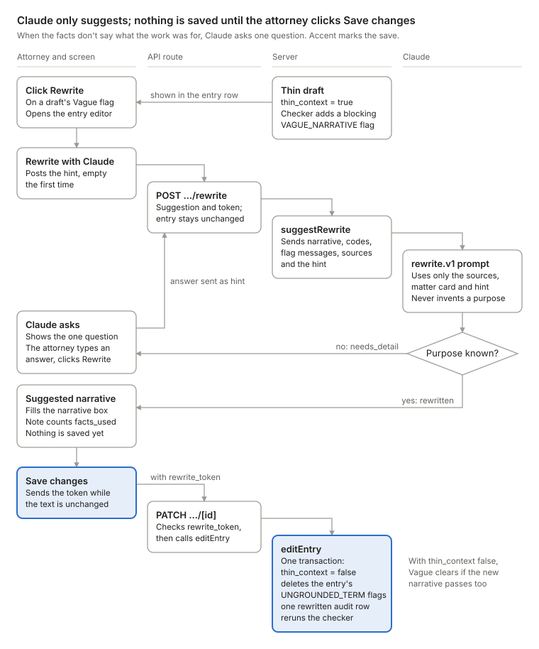

Claude either asks one question or returns a narrative built only from the sources, the matter card and the hint. The entry changes only when the attorney saves, in one audited transaction.

1. The attorney clicks Rewrite on the Vague flag, which opens the editor. Its "Rewrite with Claude" button posts `{ hint }`, empty at first, to `POST /api/entries/[id]/rewrite`.
2. `suggestRewrite` in `src/server/pipeline.ts` sends the narrative, codes, flag messages, sources and hint to Claude with `rewrite.v1`.
3. Claude returns `needs_detail` with one question, or `rewritten` with a narrative and the facts it used. The prompt allows facts only from the sources, the matter card and the hint; code does not check this.
4. A question shows as "Claude asks: …", and the attorney's answer goes back as the hint.
5. Nothing is saved until "Save changes" sends `PATCH /api/entries/[id]` with `via: "rewrite"`. `editEntry` clears `thin_context`, deletes the entry's `UNGROUNDED_TERM` flags, writes one `rewritten` audit row and reruns the checker. `VAGUE_NARRATIVE` clears if the new narrative also passes the other vague checks.

In the demo, the Notes.docx entry on day 03 is flagged Vague, and the scripted answer is "Calder 30(b)(6) depo outline". Only oracle mode has run this path so far, and there any non-empty answer returns the answer key's narrative.

## Time math

Billed time is `ceil(seconds / 360)` tenths of an hour, computed once per entry and stored as an integer from 1 to 240. Every duration comes from code; Claude sees estimated minutes only as context.

```text
units_tenths = min(240, ceil(entry_seconds / 360))
```

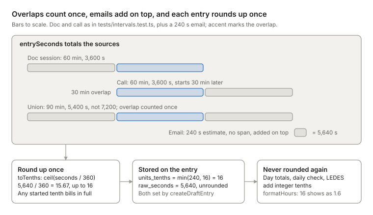

Overlapping spans count once, emails add their estimate on top, and the total rounds up to whole tenths exactly once. Everything after that adds integers.

### Seconds per activity

Ingest sets each activity's seconds in `src/server/ingest/normalize.ts`. Email estimates use the `EST` constants in `src/server/ingest/estimate.ts`.

| Source | Seconds | `duration_basis` |
| --- | --- | --- |
| Sent email | min(1800, round(120 + 1.5 × words + 30 × attachments)) | `estimated` |
| Received email, opened | min(900, round(max(60, 0.3 × words))) | `estimated` |
| Received email, unopened | 0 | `none` |
| Calendar event | End minus start | `scheduled` |
| Calendar event, declined | 0 | `none` |
| Doc session | `active_seconds` | `measured` |
| Call | `duration_seconds` | `exact` |
| Calendar event merged with its call | The call's seconds | `exact` |

Matching ignores activities with 0 seconds, so they never reach an entry.

### Merging a meeting with its call

`reconcileDay` replaces a calendar event's booked time with the call log's real time. It pairs them when the call's number belongs to an attendee and the two starts are at most 600 s apart. On day 03, a 30-minute booking and a 2,520-second call become one 42-minute activity, and the call row is ignored as `merged`.

### Seconds inside an entry

`entrySeconds` in `src/server/time/intervals.ts` totals an entry's sources:

1. Treat calls, calendar events and doc sessions as spans that start at `started_at` and last their seconds.
2. Sort the spans and count overlapping time once.
3. Add each email's estimate on top, since emails have no reliable span.
4. Sum the credits. Each activity's credit is kept in `entry_sources.seconds`.

For example, a 60-minute doc session at 10:00 and a 60-minute call at 10:30 total 5,400 s, not 7,200.

### Rounding once

`createDraftEntry` is the only caller of `toTenths`, and it rounds each entry's total once. It stores `units_tenths` and keeps the unrounded total in `raw_seconds`. One second bills as 0.1 h and 361 s as 0.2 h. `toTenths` rejects zero, negative and fractional seconds.

Everything downstream adds integer tenths and never rounds again: day totals, the daily-total check and LEDES units. `formatHours` prints 12 tenths as "1.2".

### Shared rounding fixture

`contracts/fixtures/rounding.json` pins 11 cases that the TypeScript and Go tests both run, and both must reject 0 and −5.

| Seconds | 1 | 360 | 361 | 3,600 | 3,601 | 5,399 | 86,400 |
| --- | --- | --- | --- | --- | --- | --- | --- |
| Tenths | 1 | 1 | 2 | 10 | 11 | 15 | 240 |

Go's `Tenths` in `checker-go/internal/rounding/rounding.go` computes `(seconds + 359) / 360` in integers. The Go service also serves it at `POST /v1/round`, but the app always rounds in TypeScript.

## Entries service and audit trail

`src/server/entries/service.ts` is the only code that writes `time_entries`, `entry_flags` and `audit_events`. Each entry action (edit, approve, reject, reopen) runs in one transaction: lock the row, check the version, change it, and write exactly one audit row. `resolveActivity` takes no version and writes one audit row per activity it places.

### Write functions

| Function | What it changes | Audit `action` |
| --- | --- | --- |
| `createDraftEntry` | Inserts a `draft` entry with its time, its `entry_sources` rows and any `UNGROUNDED_TERM` warnings | `created` |
| `editEntry` | Only the fields that changed, on a draft. A new narrative clears `thin_context` and deletes the entry's `UNGROUNDED_TERM` flags | `edited`, or `rewritten` when `via` is `rewrite` |
| `approveEntry` | Status to `approved`. Stores the override reason on blocking flags | `approved` |
| `rejectEntry` | Status to `rejected`, with a reason | `rejected` |
| `reopenEntry` | Status back to `draft` | `reopened` |
| `resolveActivity` | Places a queued activity, and queued emails in the same thread, on a matter, or marks them admin, personal or ignored | `resolved`, one per activity |
| `recomputeDayFlags` | Replaces the day's checker flags | none |
| `audit` | Inserts one audit row; ingest, matching and LEDES export call it inside their own transactions | the caller's |

The same file builds the read models behind the screen: `getDayView`, `getQueue`, `getEntryViews`, `getEntrySources` and `getEntryHistory`.

### Entry lifecycle

An entry is `draft`, `approved` or `rejected`, enforced by a check constraint. Every entry starts as a `draft`.

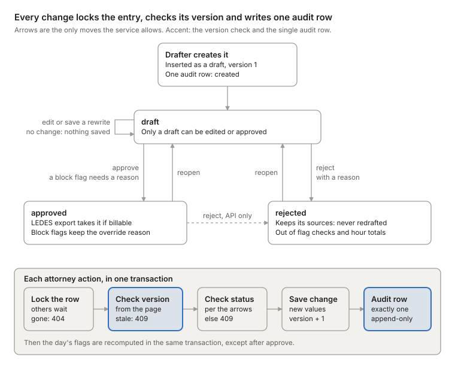

An entry is born a draft and changes only along the arrows. Each attorney action runs the same five steps in one transaction, so a stale page gets a 409 and every real change leaves exactly one audit row.

| Action | Allowed from | Result | Refused with |
| --- | --- | --- | --- |
| Edit, or save a rewrite | `draft` | stays `draft` | 409 "Only drafts can be edited. Reopen the entry first." |
| Approve | `draft` | `approved` | 409 if not a draft. 422 if a `block` flag exists and no override reason is given |
| Reject, with a reason | `draft` or `approved` | `rejected` | 409 "This entry is already rejected." |
| Reopen | `approved` or `rejected` | `draft` | 409 "This entry is already a draft." |

The screen shows Reject only on drafts. A rejected entry keeps its `entry_sources` rows, so its activities are never drafted again.

### Versions and locking

Every action sends the `version` the page loaded. `lockEntry` reads the row with `select … for update`, returns 404 if it is gone, and returns 409 "This entry changed since you loaded it" on a mismatch. A successful write bumps `version`, and the audit row records the new one.

### Flags after a change

`recomputeDayFlags` runs the configured checker over the day's non-rejected entries. It deletes their old flags except `UNGROUNDED_TERM`, inserts the new ones, and carries saved override reasons across. A rejected entry drops out of the check and keeps the flags it had. Day-level flags such as `DAILY_TOTAL` are never stored: `getDayView` reruns the checker on every read.

Edits never rerun time math. The attorney's `units_tenths` (1 to 240) is stored as sent, and `raw_seconds` keeps the drafted value.

### What an audit row holds

| Column | Content |
| --- | --- |
| `subject_type`, `subject_id` | `entry`, `activity`, `day` or `export`, and that row's id |
| `version` | The entry's new version; null for other subjects |
| `actor` | `attorney:DW` for screen actions; `anthropic:draft.v1` for drafts; `attorney:DW via claude:rewrite.v1` for saved rewrites; `system` for ingest; `system+anthropic:match.v1` for matching that asked Claude, or plain `system` when rules placed everything |
| `action` | `created`, `edited`, `rewritten`, `approved`, `rejected`, `reopened`, `resolved`, `matched` or `exported` |
| `before`, `after` | Old and new values of what changed; `before` is null on creation |
| `reason` | The reject reason, or the approve override reason |

The trigger `audit_events_no_change` raises "audit_events is append-only" on any UPDATE or DELETE. `npm run db:reset` still empties the table, because it uses TRUNCATE, which row triggers never see.

Three other modules add one audit row each by calling `audit()` from this file inside their own transactions: ingest (`day` / `created`), matching (`day` / `matched`) and LEDES export (`export` / `exported`). No other file inserts into `audit_events`.

## Billing guidelines engine

Six billing rules check every entry that is not rejected, in two twins that must agree: `src/server/guidelines/rules.ts` (TypeScript, `ts@1`, the default) and `checker-go/internal/guidelines/rules.go` (Go, `go@1`). Both pass the same 42 golden cases in `contracts/fixtures/guidelines.json`. Profile limits and word lists are data in `config/firm.yaml`; the rules, the 15-minute overlap limit and the communication codes `A105`–`A108` are code.

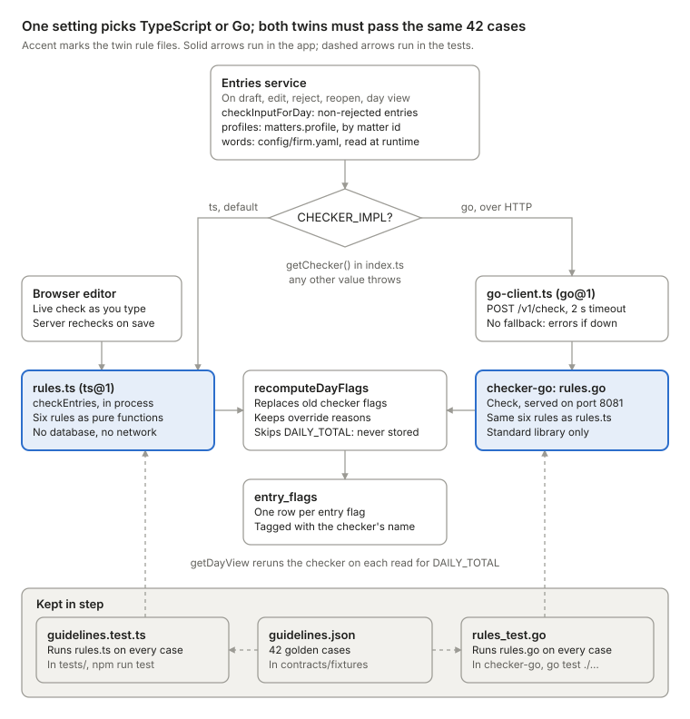

The entries service builds one input for the day. `CHECKER_IMPL` sends it to `rules.ts` in process or to `rules.go` over HTTP, with no fallback, and the flags that come back are stored in `entry_flags`. Both test suites run the same 42 cases, which is what keeps the twins in step.

### Rules

| Flag | Fires when | Severity |
| --- | --- | --- |
| `BLOCK_BILLING` | Two or more clauses start with different task verbs, and some pair is not a same-task pair such as draft + revise | The profile's `block_billing` |
| `VAGUE_NARRATIVE` | Thin context, a vague phrase, fewer than `min_words` words, a generic last word such as "notes", or a communication that names nobody | `block` |
| `LONG_ENTRY` | Above `max_entry_tenths`, or a communication (`A105`–`A108`) above `comm_max_tenths` | `warn` |
| `NON_BILLABLE_ADMIN` | A billable entry has an admin phrase, or one of its activities is admin | `block` |
| `OVERLAP` | Two billable entries' spans overlap by more than 15 minutes; both get the flag | `warn` |
| `DAILY_TOTAL` | The day's billable tenths exceed `daily_max_tenths`; the flag belongs to the day | `warn` |

Every cap is strict, so an entry exactly at its limit passes. A `block` flag stops approval unless the attorney gives an override reason.

### Client profiles

| Parameter | `default` (`M-1001`, `M-1003`) | `strict` (`M-1002`) |
| --- | --- | --- |
| Longest entry | 30 tenths (3.0 h) | 20 tenths (2.0 h) |
| Fewest narrative words | 6 | 8 |
| Block billing | `warn` | `block` |
| Longest communication entry | 10 tenths (1.0 h) | 6 tenths (0.6 h) |
| Longest day | 100 tenths (10.0 h) | 100 tenths (10.0 h) |

Each entry's profile key is its matter id, which the request maps to that matter's profile, so strict and default clients can share a day. The day cap is one number: the smallest `daily_max_tenths` across all matters. Profiles reach the checker from the seeded `matters.profile` column; word lists come from `config/firm.yaml` at runtime.

### TypeScript or Go

`getChecker()` in `src/server/guidelines/index.ts` uses the in-process `checkEntries` unless `CHECKER_IMPL=go`. Then `src/server/guidelines/go-client.ts` posts the same input to the Go service's `POST /v1/check`, with a 2-second timeout and no fallback. If the service is down, every call that runs the checker fails with an error that says to start it or set `CHECKER_IMPL=ts`: drafting a day (after its entries are saved), placing a queued item on a matter, editing, rejecting, reopening, and opening a day that has entries. Approving does not call the checker.

The Go service in `checker-go/` uses only the standard library and serves `POST /v1/check`, `POST /v1/round` and `GET /healthz` on port 8081. Each stored checker flag records the checker that computed it, and `UNGROUNDED_TERM` rows record `validator@1`. The page footer names the checker configured now, which can differ from the one behind flags already stored. The editor also runs the TypeScript rules in the browser as the attorney types.

### Keeping the twins in step

`contracts/checker.schema.json` defines the request (profiles, word lists, day cap, entries) and the response (flags with entry, code, severity, message and evidence). Both test suites run every case in `contracts/fixtures/guidelines.json` and compare the entry and code of each flag, plus severity where a case pins it.

| Test | Runs with |
| --- | --- |
| `tests/guidelines.test.ts` | `npm run test` |
| `checker-go/internal/guidelines/rules_test.go` | `go test ./...` |
| `checker-go/internal/httpapi/handler_test.go` | `go test ./...` |

The project rule is to change `rules.ts` and `rules.go` together, and both must pass the fixtures. Both reject interval times that are not strict RFC 3339 date-times. `UNGROUNDED_TERM` is not a checker flag; the draft validator adds it.

## Review screen, API and LEDES export

The review screen is two client-side pages backed by 13 API routes under `src/app/api`. Each change (drafting, approving, rejecting, reopening, editing, placing a queued item) calls a route, the route calls the server code, and the page then reloads the whole day. Rewrite suggestions, the two drawers and the LEDES download do not reload it.

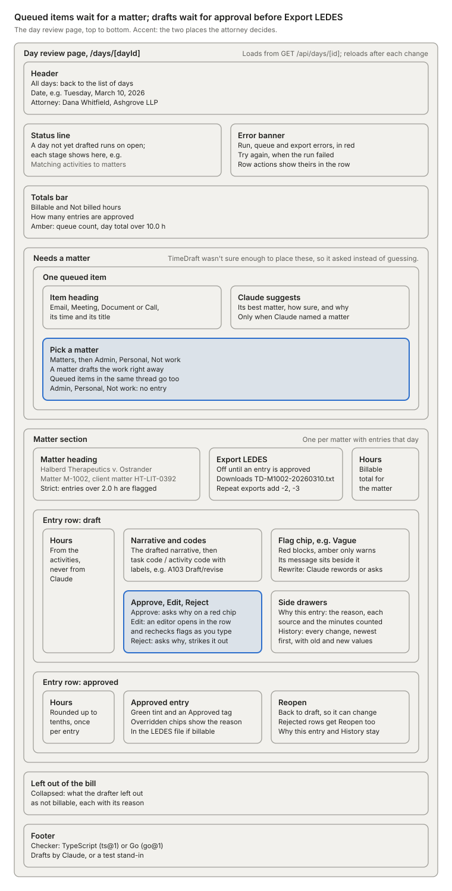

Activities TimeDraft could not place wait under Needs a matter; picking a matter drafts them at once. Drafts wait for Approve, which asks for a reason when a chip is red, and Export LEDES takes only approved, billable entries.

### Pages

| Page | File | Shows |
| --- | --- | --- |
| `/` | `src/app/page.tsx` | One row per synthetic day: date, source counts, a status ("X.Y h drafted", "Loaded" or "Not drafted yet") and an Open or "Draft this day" button |
| `/days/[dayId]` | `src/app/days/[dayId]/page.tsx` | The review screen for one day |

The day page runs top to bottom: header, live status line, error banner, totals (`TotalsBar`), "Needs a matter" (`ReviewQueue`), then one section per matter with its entry rows and an Export LEDES button. "Left out of the bill" and a footer naming the checker and LLM mode close the page.

### Entry rows and flags

Each row in `src/components/EntryRow.tsx` shows hours, the narrative, both codes and flag chips. Drafts offer Approve, Edit and Reject, approved or rejected rows offer Reopen, and every row has "Why this entry" and "History".

| Flag | Chip | Shortcut on a draft |
| --- | --- | --- |
| `VAGUE_NARRATIVE` | Vague | Rewrite |
| `NON_BILLABLE_ADMIN` | Admin time | Mark not billed |
| `BLOCK_BILLING` | Several tasks | none |
| `LONG_ENTRY` | Long | none |
| `OVERLAP` | Overlap | none |
| `UNGROUNDED_TERM` | Name not in sources | none |
| `DAILY_TOTAL` | No chip; the totals bar shows its message as an amber line | none |

Red chips (`block`) stop approval until the attorney answers "Why approve it anyway?"; amber chips (`warn`) only warn. The editor reruns the TypeScript rules in the browser as the attorney types, and the server checks the whole day again on save.

### Routes

| Screen action | Route | Server function |
| --- | --- | --- |
| Open the home page | `GET /api/fixtures` | A query in the route |
| Load a day | `POST /api/days` | `ingestFixture` |
| Open a day; reload after every action | `GET /api/days/[id]` | `getDayView` |
| Draft the day, streamed | `POST /api/days/[id]/run` | `runDay` |
| Pick a matter for a queued item | `POST /api/activities/[id]/resolve` | `resolveAndDraft` |
| Edit, or save a rewrite | `PATCH /api/entries/[id]` | `editEntry` |
| Approve | `POST /api/entries/[id]/approve` | `approveEntry` |
| Reject | `POST /api/entries/[id]/reject` | `rejectEntry` |
| Reopen | `POST /api/entries/[id]/reopen` | `reopenEntry` |
| Ask for a rewrite | `POST /api/entries/[id]/rewrite` | `suggestRewrite` |
| Why this entry | `GET /api/entries/[id]/sources` | `getEntrySources` |
| History | `GET /api/entries/[id]/history` | `getEntryHistory` |
| Export LEDES | `GET /api/matters/[id]/ledes?day=` | `exportMatterDay` |

Request bodies are checked with zod: a JSON body that fails its schema returns 400, and a body that is not JSON returns 500 (the rewrite route treats it as empty). Other errors map to 404 (not found), 409 (stale version or wrong status), 422 (unknown code, block flag without a reason, nothing to export) and 500. The run route always answers 200 and reports errors as `error` events in the stream.

No route checks who is calling. Attorney actions are recorded as `attorney:DW`, and rows written while loading, matching or drafting a day carry `system` or the model's actor, such as `anthropic:draft.v1`.

### Why this entry and History

- **Why this entry** shows the drafter's one-sentence reason, then each source activity: its time, the minutes counted and how they were measured, a snippet, and the match evidence. It states "Time comes from these activities, never from the model."
- **History** lists the entry's audit rows, newest first, with the actor and each changed field's old and new value.

### LEDES export

"Export LEDES" downloads one LEDES 1998B invoice for one matter on one day, built from that day's approved, billable entries.

1. `exportMatterDay` in `src/server/export/ledes.ts` selects the entries; finding none returns 422.
2. Inside one transaction, it takes an advisory lock for the matter and day, so concurrent exports get distinct invoice numbers.
3. The invoice number is `TD-<matter id without hyphen>-<YYYYMMDD>`, such as `TD-M1002-20260310`. Repeat exports add `-2`, `-3` and so on.
4. `buildLedes` writes `LEDES1998B[]`, the 24 field names, then one fee line per entry, each ending in `[]`.
5. The same transaction stores the file in `exports` and writes an `exported` audit row.

Each line's total is round(tenths × rate_cents / 10) cents, so 12 tenths at $450 an hour is $540.00. The invoice total is the sum of the lines, and the rate and timekeeper come from `config/firm.yaml`.

## Evaluation harness

TimeDraft is measured on 12 synthetic days with answer keys: 154 activities and 38 planted traps, split into 8 dev days and 4 holdout days. `npm run eval` resets `time_draft_eval` once, then runs the real pipeline on each day of one split (`dev` unless `--split` says otherwise) and writes a report to `evals/reports/`. Reports are git-ignored, so the repo holds none, and the README says the Claude path has never run live.

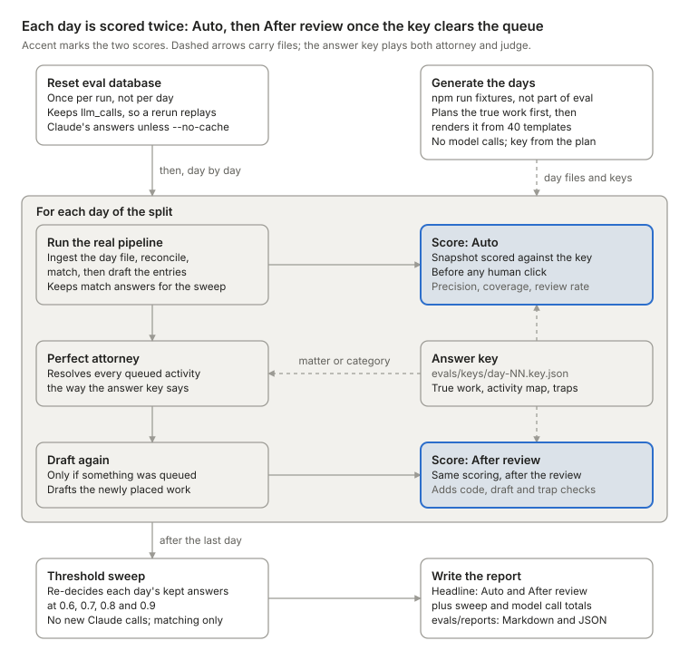

The run resets the eval database once, then runs the real pipeline on each day and scores it as Auto. The answer key then clears the queue like a perfect attorney, the newly placed work is drafted, and the day is scored again as After review. After the last day, the sweep re-decides the stored match answers at four thresholds without calling Claude.

### Days and answer keys

`evals/generate.ts` plans each day's true work first, then renders the artifacts that work would leave from 40 fixed templates. The answer key is written from the plan, and generation makes no model calls.

| File | Holds |
| --- | --- |
| `evals/days/day-NN.json` | The day's emails, calendar events, document sessions and calls |
| `evals/keys/day-NN.key.json` | The split, the true work blocks (matter, codes, true seconds, summary, thin), a map from every activity to its block, and the planted traps |

Day 03 (Tuesday, March 10, 2026) is the demo day. Its 16 activities hold four traps: a 30-minute meeting and a 42-minute call that are one event, a shared expert's email thread, a CLE webinar, and a thin Notes.docx session.

### Planted traps

| Trap | Days | Passes when |
| --- | --- | --- |
| `duplicate_call` | 03, 06, 09, 12 | The meeting and its call merge into one activity |
| `shared_expert` | 03, 04, 07, 09, 12 | Every activity is queued, or billed to the right matter |
| `internal_email` | 02, 06, 10, 12 | Every activity is queued, or billed to the right matter |
| `phone_only` | 01, 04, 08, 11 | Every activity is queued, or billed to the right matter |
| `admin` | 01, 03, 05, 06, 08, 10, 11 | Activities are admin or ignored, or the entry gets `NON_BILLABLE_ADMIN` |
| `personal` | 02, 05, 09 | Activities are personal or ignored |
| `declined` | 01, 04, 07, 11 | Activities are personal or ignored |
| `long_block` | 02, 05, 08, 11 | The entry gets `LONG_ENTRY` |
| `thin_context` | 03, 07, 10 | The entry gets `VAGUE_NARRATIVE` |

### What a run does

1. Reset the eval database once, keeping the Claude cache in `llm_calls`.
2. For each day, run ingest, reconcile, match and draft, then score the result as **Auto**.
3. Clear the review queue from the key, as a perfect attorney would, draft again, and score as **After review**.
4. Re-decide the stored match answers at thresholds 0.6, 0.7, 0.8 and 0.9, with no new Claude calls.
5. Count this run's live Claude calls by purpose from `llm_calls`, with input and output tokens and p50 and p95 latency. Cache hits write no row, so they are not counted.
6. Write `evals/reports/<time>-<split>.md` and a matching `.json`.

Flags: `--split dev|holdout|all`, `--threshold`, `--checker ts|go`, `--llm anthropic|oracle` and `--no-cache`.

### Headline metrics

The report shows 17 headline rows in Auto and After review columns. Five have targets:

| Metric | Target |
| --- | --- |
| Cross-client errors: activities billed to the wrong client's matter | 0 |
| Auto precision: placements without a human that are correct | at least 0.95 |
| Non-billable activities placed on a matter (a count, not hours) | 0 |
| Capture ratio: captured time over true observable time | 0.90 to 1.10 |
| Drafts passing the vague check | at least 0.95 |

The other 12 are reported without a target: coverage, review rate, admin caught, leakage, over-capture, billed against true tenths, task and activity code accuracy, blocks drafted as one entry, names not in the sources, traps caught, and block flags on clean entries.

An oracle run (`--llm oracle`) answers from the keys, holdout included, so it tests only the machinery. Its report says "NOT a Claude result" in the run line.

## Configuration and synthetic data

Configuration is 10 environment variables plus one firm file, `config/firm.yaml`, both loaded by `src/lib/config.ts`. `loadEnv()` reads `.env.local`, then `.env`, and a variable that is already set wins.

### Environment variables

| Variable | Default | Effect |
| --- | --- | --- |
| `DATABASE_URL` | none; required | The dev database for the app, the `db:*` scripts and `day:load` |
| `EVAL_DATABASE_URL` | none; required for tests and evals | The eval database |
| `ANTHROPIC_API_KEY` | none | Needed only on a cache miss in `anthropic` mode |
| `MODEL_MATCH` | `claude-haiku-4-5-20251001` | The model for matching |
| `MODEL_DRAFT` | `claude-sonnet-5-5` | The model for drafting, repair and rewrite |
| `LLM_MODE` | `anthropic` | `oracle` answers from the eval keys, for tests only; any other value throws |
| `LLM_CACHE` | `on` | `off` skips the `llm_calls` replay; calls are logged either way |
| `MATCH_THRESHOLD` | `0.8` | The minimum confidence for Claude's match |
| `CHECKER_IMPL` | `ts` | `go` sends guideline checks to the Go service; any other value throws |
| `CHECKER_URL` | `http://localhost:8081` | The Go service's address |

The Go checker reads one more, `ADDR`, which defaults to `:8081`. On the command line, `npm run eval` and `npm run day:load` take `--llm`, which sets `LLM_MODE`. Only `npm run eval` takes `--no-cache`, which sets `LLM_CACHE=off`.

Of the matching thresholds, only `MATCH_THRESHOLD` is runtime config. The rule weights, `AUTO_SCORE`, `AUTO_LEAD` and `CONFLICT_SCORE` are constants in `src/server/match/rules.ts`.

### The firm file

`config/firm.yaml` describes one fictional firm, Ashgrove LLP, and is the single source of truth for its matters, contacts, guideline limits and word lists; the rules themselves are code. `loadFirm()` validates it with the zod schema `FirmConfigZ` and caches it per process, so an edit needs a restart. Matter or profile changes also need `npm run db:seed`, because the guideline checker reads profiles from the `matters` table.

Word lists fan out: `admin` feeds the matcher and the checker, `personal` only the matcher, and `generic_caps` the checker and the ungrounded-name check. Local time is `America/New_York`, hard-coded in `src/server/match/llm.ts` and three components; the file's `timezone` key is validated but never read.

| Key | Holds |
| --- | --- |
| `firm` | Name, domain `ashgrove.example`, LEDES firm id, admin senders and phones, colleagues |
| `attorney` | The one timekeeper: `DW`, "Whitfield, Dana", classification `AS`, $450 an hour |
| `profiles` | Guideline limits: `default` and `strict` |
| `matters` | Three matters, each with client, parties, domains, phones, keywords and document folders |
| `shared_contacts` | People on more than one matter: Lena Park of Brightline Forensics |
| `words` | Eight word lists the rules treat as data, such as task verbs, vague phrases, admin and personal words |

| Matter | Short name | Profile | Client matter id |
| --- | --- | --- | --- |
| `M-1001` | Kestrel v. Calder | `default` | `KL-2026-014` |
| `M-1002` | Halberd v. Ostrander | `strict` | `HT-LIT-0392` |
| `M-1003` | Ruiz v. Bellhaven | `default` | `BHG-EMP-2207` |

### Synthetic data

`evals/days/` holds 12 synthetic days, March 5 to March 23, 2026, and `evals/keys/` holds an answer key for each. Days 01 to 08 are the dev split and 09 to 12 the holdout. `npm run fixtures` regenerates both folders from seed 42; `--seed N` or `--seed=N` picks another, and anything but a whole number is refused.

Every name, `.example` domain and 555-01xx phone number is fictional. The project rules forbid adding real names, firms, domains or numbers.

## Running locally

You need Node 20.12 or newer and Docker for Postgres 16. Go 1.22 or newer is optional, for the Go checker. Everything runs against two local databases: `time_draft_dev` for the app and `time_draft_eval` for tests and evals.

### First run

1. `cp .env.example .env.local`, then set `ANTHROPIC_API_KEY`. Or set `LLM_MODE=oracle` to test the plumbing without Claude.
2. `npm install`
3. `npm run db:up` starts Postgres 16 on `localhost:5432`.
4. `npm run db:migrate && npm run db:seed` builds the schema and seeds the attorney, 3 matters and 40 UTBMS codes.
5. `npm run dev` serves the review screen at `http://localhost:3000`.

The Postgres container has no healthcheck, so if step 4 fails while it is still starting, run it again. The eval database needs no setup: `migrate` creates it on first use.

### Commands

| Command | Database | What it does |
| --- | --- | --- |
| `npm run dev` | dev | The review screen on port 3000 |
| `npm run day:load -- day-03` | dev; `--eval` for eval | Drafts one day in the terminal; `--llm oracle` skips Claude |
| `npm run db:reset` | dev; `-- --eval` for eval | Empties the app tables and reseeds; `-- --all` also clears the Claude cache |
| `npm run test` | eval | 119 Vitest cases; only the entries-service test touches Postgres, using the oracle |
| `npm run typecheck` | none | Strict TypeScript over every file outside `checker-go` |
| `npm run eval -- --split dev` | eval | Drafts and scores the 8 dev days |
| `npm run fixtures` | none | Regenerates the 12 days and keys from seed 42 |
| `cd checker-go && go vet ./... && go test ./...` | none | The Go checker's tests against the shared fixtures |

`npm run test` and `npm run eval` both reset the eval database, so run them one at a time.

### Services and ports

| Service | Port | Start with |
| --- | --- | --- |
| Postgres 16 | 5432 | `npm run db:up` |
| Next.js | 3000 | `npm run dev` |
| Go checker | 8081 | `docker compose --profile go up -d checker`, or `cd checker-go && go run ./cmd/checker` |

To use the Go checker, start it and run `CHECKER_IMPL=go npm run dev`. The page footer then shows `go@1`.

Before a demo, do one warm-up run so Claude's answers are cached, then `npm run db:reset`. Setting `LLM_CACHE=off` forces live calls.

## Changing TimeDraft safely

Most changes touch more files than the obvious one. These checklists come from the code paths each change crosses.

### Add or change a guideline rule

- A new flag code touches `rules.ts`, `rules.go`, `FlagCode` in `src/lib/types.ts`, the golden fixtures, the `FlagChip` labels and `contracts/checker.schema.json`, which no test reads.
- New input fields or profile limits also need `checkInputForDay`, `ProfileZ` in `src/lib/config.ts` and the Go structs. Go answers 400 to unknown fields.
- `rules.ts` and `src/lib/utbms.ts` run in the browser too, so they must not import config, database or Node modules. Only `next build` catches a violation.

### Change a prompt

- Copy the prompt file with a new `VERSION`, switch its import in `src/server/llm/client.ts`, and update the hard-coded actors `match.v1` (`src/server/match/index.ts`) and `claude:rewrite.v1` (`src/server/entries/service.ts`).
- Any change to prompt text, schema or model changes the cache key, so the next run calls Claude and needs an API key.
- The oracle bypasses prompts and the client, so tests cannot catch a prompt regression. Only a live eval measures it.

### Add a matter

- Add it to `config/firm.yaml` with an `M-####` id, a known profile and LEDES ids of up to 20 characters, then run `npm run db:seed` and restart.
- Every matter card is in the match prompt and every matter id in its schema, so any matter change voids cached match answers.
- The generator and `tests/fixtures.test.ts` know only `M-1001` to `M-1003`, so evals never score a new matter. `db:seed` never deletes a removed one.

### Change the schema

Add a new numbered file in `db/migrations`; never edit `001_init.sql`, which existing databases will not re-run. See Data model, Migrations.

### Keep transactions short

- Claude is always called before a transaction opens, so no row lock or pooled connection (6 per process) waits on Claude. Keep new code that way.
- The run route's guard is an in-memory set. `day:load` and resolve-and-draft skip it, so the unique index on `entry_sources(activity_id)` is the real backstop.
- Each matter's entries commit separately, and LEDES exports serialize on a per-matter-day advisory lock.

### Errors and retries

- Expected failures throw `HttpError(status, message)` from `src/server/entries/service.ts`. Routes return `jsonError(err)`, which keeps that status, turns a zod error into 400 and anything else into 500 with the raw message shown on screen.
- Only three things retry: SDK API errors, a first `max_tokens` stop and one draft repair. Refusals, zod failures and checker errors fail at once.

### What the tests do not cover

- `runDay` takes its dependencies (LLM, checker, threshold), so database tests inject `oracleLLM` and the TypeScript checker against the eval database.
- No test runs `callStructured`, the cache, the Go client, the routes or the server-sent events.
- The golden fixtures carry their own word lists, not those in `config/firm.yaml`.

## Invariants and guardrails

Nine rules in the project's `CLAUDE.md` must never break. The table shows what enforces each one in the code today; the known gaps below show where enforcement is only partial.

| Rule | Enforced by |
| --- | --- |
| Claude never returns a duration; billed tenths are `ceil(seconds / 360)`, once per entry, as an integer | No output schema has a time field; `createDraftEntry` is the only caller of `toTenths`; `units_tenths` is a `smallint` checked to 1–240; TypeScript and Go share `contracts/fixtures/rounding.json` |
| Only `src/server/entries/service.ts` writes entries and flags, with one audit row per change in the same transaction | Each service function runs in `withTx`; `tests/entries-service.test.ts` counts audit rows per edit |
| `audit_events` is append-only | Trigger `audit_events_no_change` rejects UPDATE and DELETE; the entries-service test checks it |
| Every Claude call goes through `src/server/llm/client.ts` | It is the only file that imports `@anthropic-ai/sdk`; structured outputs, zod, `llm_calls` logging and the cache all live in `callStructured` |
| Below `MATCH_THRESHOLD`, or with quotes not in the text, an activity goes to the review queue | `decide` in `src/server/match/index.ts`; `tests/match-rules.test.ts` covers low confidence, invented quotes and missing answers |
| `rules.ts` and `rules.go` change together and pass the shared fixtures | Both test suites run the 42 cases in `contracts/fixtures/guidelines.json` |
| `LLM_MODE=oracle` is for tests only and never reported as a result | Labels in the eval report, the CLI output and the page footer |
| Local Postgres only | `assertLocal` in `src/server/db.ts` refuses any other host |
| Synthetic data only | Convention; `evals/generate.ts` refuses contacts that are not in `config/firm.yaml` |

### Known gaps

Each gap below was confirmed twice against the code on `main` after PR #15, by two independent reviewers. The first column is ordered by impact.

| Gap | Where |
| --- | --- |
| Flag rewrites, the drafter's queue and ignore updates, call merges, and the `reconciled`, `drafted` and `failed` statuses write no audit row | `recomputeDayFlags`, `src/server/draft/index.ts`, `src/server/ingest/reconcile.ts`, `src/server/pipeline.ts` |
| `npm run db:reset`, evals and the database test truncate `audit_events`; the row trigger cannot stop TRUNCATE | `resetDb` in `src/server/db.ts` |
| A Claude answer that fails zod is still cached, so identical calls keep failing until `LLM_CACHE=off` or `db:reset -- --all` | `src/server/llm/client.ts`, `src/server/llm/cache.ts` |
| A zod failure on Claude's output reaches the screen as 400 "The request body is not valid." | `jsonError` in `src/server/pipeline.ts` |
| An empty or non-numeric `MATCH_THRESHOLD` turns the confidence check off | `defaultDeps` in `src/server/pipeline.ts` |
| The quote check also accepts quotes from participants and up to four neighbouring activities, wider than "in the text" | `quoteIsReal` in `src/server/match/llm.ts` |
| Re-approving a reopened entry whose block flag was overridden fails with 422: the screen sends no reason, the server wants one | `src/components/EntryRow.tsx`, `approveEntry` |
| Oracle runs are labelled but allowed on any split, holdout included, under normal report names | `evals/run.ts` |
| The page footer shows the server's current `LLM_MODE`, not how the entries on screen were drafted | `getDayView` |
| A saved rewrite is audited as `via claude:rewrite.v1` whatever wrote it, because the server trusts the client's `via` | `editEntry` |
| The README's Lena Park queue step is not guaranteed: her emails score under 0.6, so a confident, quoted answer is placed automatically | `decide`, `README.md` |
| The TypeScript and Go checkers still differ on Unicode whitespace and message quoting, and no test runs both on one day | `rules.ts`, `rules.go` |
| LEDES export is a GET that writes an export row, an audit row and a new invoice number on every call | `src/app/api/matters/[id]/ledes/route.ts` |
| Unit tests read the holdout days and keys | `tests/match-rules.test.ts`, `tests/reconcile.test.ts` |
| Some time math sits outside `src/server/time`: the 240 cap, email estimates and the eval's own rounding | `createDraftEntry`, `src/server/ingest/estimate.ts`, `evals/score.ts` |
| A rejected entry keeps its sources, so its activities are never redrafted; only Reopen recovers them | `draftDay` |
| A doc session's span ends at its start plus `active_seconds`, not at its recorded end | `src/server/time/intervals.ts` |

PR #15 already fixed six earlier gaps: audit rows now go through one function, a failed run reconciles again, entries dropped for a bad code queue their activities, concurrent LEDES exports get distinct numbers, TypeScript parses interval times as strictly as Go, and `npm run fixtures` really uses seed 42.

## Production design for many users (proposal)

This section is a design proposal, not a description of today's code. It sketches how TimeDraft could serve many firms and many users at once. Every TTL and retention period below is a proposed default for each firm to set by its own policy, and the sizing numbers are estimates. An independent reviewer checked the design against the code, and its corrections are folded in.

The idea in one line: move every lock, job, event and record into Postgres, so web, SSE and worker pods hold no state and can scale out. Claude stays behind `src/server/llm/client.ts` and is never called inside a transaction, and Redis holds only sessions and rate counters.

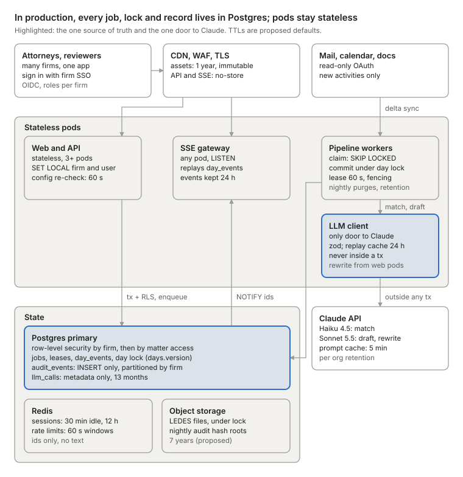

Browsers reach the pods through a CDN that caches only static assets. Every job, lock, event and record lives in Postgres, which also enforces who can see what. Only the LLM client calls Claude, always outside a transaction, and object storage keeps invoices and audit hash roots.

### What changes from today

| Area | Today | In production | Why |
| --- | --- | --- | --- |
| Who is calling | No route checks the caller. Screen actions are recorded as `attorney:DW`, and keys such as `matters.id` are global. | Per-firm OIDC sign-in with roles (attorney, reviewer, firm admin). Every table gets `firm_id`. Forced row-level security filters by firm, and matter-scoped tables also check a `matter_access` view (staffing minus ethical walls). Each transaction starts with `SET LOCAL app.firm_id` and `app.user_id`, and audit rows name `user:<uuid>`. | A forgotten `WHERE` clause returns zero rows instead of another firm's, or a walled matter's, privileged text. |
| Walls in prompts | Each matter card appends shared contacts' notes about other matters (`src/lib/config.ts:146-149`), and the match prompt lists every matter. | Cards are rendered per attorney, keeping a contact's note only for matters on that attorney's unwalled roster. Match sends only staffed, unwalled matters under one schema for all firms, and `decide()` queues any matter outside the roster. Staffing and walls are re-read before every Claude call and at every commit. | Walled details must never reach a prompt, or the grounding text for `UNGROUNDED_TERM`. |
| Runs | Runs execute inside `POST /api/days/[id]/run`, guarded by an in-memory `Set`. Opening an undrafted day starts a run, and resolving a queued activity drafts inline. | `POST /api/days/{id}/runs` returns 202 with the day's queued or running job, inserting one only when there is none. Workers claim jobs with `FOR UPDATE SKIP LOCKED` under a 60 s lease and a fencing token. Resolve enqueues one coalesced `draft_day` job, and opening a page never starts a run. | A `Set` guards one process. Two replicas would pay Claude twice, and the loser would fail on the `entry_sources` unique index. |
| Progress | SSE frames come from the process running the pipeline, and a closed tab can mark the day `failed`. | Each commit writes a `day_events` row (ids only) in the same transaction, then sends `NOTIFY`. SSE gateway pods replay rows after `Last-Event-ID`, then follow `NOTIFY`, with 15 s heartbeats. | The event commits with its change, so none is lost or early, and a viewer leaving never cancels a run. |
| Flags | Edits lock one entry, then rewrite the whole day's flags with no day lock. Checker flags land only after every matter drafts, and `getDayView` reruns the checker on each read. | Every day-scoped write starts with `UPDATE days SET version = version + 1`. Every entry write (create, edit, approve, reject, reopen, mark billed) recomputes flags under that lock. Day-level flags go in a new `day_flags` table written by `service.ts`, and a stale `days.flags_config_version` triggers a recompute after a config change. | `OVERLAP` and `DAILY_TOTAL` span entries, so concurrent edits would leave stale or duplicate flags. |
| Claude log and cache | `llm_calls` is also the cache: full request text, no firm, no expiry. An answer is logged before zod checks it, so an invalid one replays on every retry. | `llm_calls` keeps metadata only, plus cache-read and cache-write token counts. A new `llm_response_cache` keeps only zod-valid answers for 24 h, keyed by HMAC-SHA256 over the firm and the request. Production refuses `LLM_MODE=oracle`. | Retries need only the answer, and privileged request text should not sit in a log. |
| Prompt layout | One system block and one cache breakpoint. The first line names the firm, the attorney, the attorney's role and a pronoun; an example names one client's contact; the word minimum varies by profile. | Block 1 is identical for every firm: narrative rules, generic examples and the 40 UTBMS codes, about 700 tokens. Block 2 holds the matter card, the profile and its word minimum. Purpose instructions and the attorney's name move after the last breakpoint. A test renders block 1 for two firms and both profiles and expects identical bytes. | One tenant-free prefix can be cached once and read by every firm's drafts. |
| LEDES export | A `GET` writes an export row, an audit row and a new invoice number on every call, reading entries outside its transaction. Exported entries can still be reopened. | `POST /api/matters/{id}/exports` sends the entry ids and versions on screen, and a known request hash returns its stored invoice. One transaction takes the number, stores the file in a pending `exports` row and calls a new `markBilled` in `service.ts` (one `billed` audit row per entry). After the commit, the file goes to object-lock storage. Billed entries refuse edit, reject and reopen. | Retries never mint a second invoice, no lock is held during an upload, and an issued invoice never drifts from the ledger. |
| Config | `loadFirm()` reads `config/firm.yaml` once per process. Times use a hard-coded `America/New_York` in `src/server/match/llm.ts` and three review components, and the file's `timezone` key is never used. | Matters, profiles and word lists live in versioned Postgres tables. A job pins one `config_version`; writes and exports read the current one, and the export stores it with the invoice. Each attorney has a time zone, also used by the screen. Each firm sets its threshold, never below 0.8 without a new eval. | Firms edit matters while the app runs, and one run must see one config. |
| Late data | Ingest loads one file per day, and match runs only while the day has no matches. | Delta sync adds activities all day. Reconcile merges a call into a meeting only when neither is in an entry; otherwise the late call is ignored as a duplicate or queued with a `late_call` signal. New activities in a matched day enqueue the coalesced run job. | An entered activity's seconds never change under its billed tenths. |
| Database safety | `assertLocal` accepts only localhost. Append-only rests on a row trigger that `TRUNCATE` skips, and `resetDb` truncates `audit_events`. | Managed Postgres behind PgBouncer. App roles get only `SELECT` and `INSERT` on `audit_events`, and every partition gets the row trigger and a `TRUNCATE` trigger. `resetDb` drops and recreates the local dev or eval database instead. Only the `entries_writer` role, assumed inside `service.ts`, writes entries, sources and flags, and a nightly check confirms that every entry version has exactly one audit row. | Roles stop stray writes from other modules; the nightly check and per-firm hash roots catch what roles cannot prevent. |
| Errors and audit gaps | 500 responses and SSE `error` events carry raw error messages. Reconcile and drafting change billing outcomes without an audit row. | Responses carry a generic message and a request id, and logs keep allow-listed fields only. Reconcile writes one `reconciled` audit row, and each matter's drafting commit writes one `drafted` row listing what it left off the bill. | Error text can hold row data, and anything that changes a bill needs a trail. |

### Caches and TTLs

| Cache | Where | Key | TTL | Cleared by |
| --- | --- | --- | --- | --- |
| Shared prompt block | Anthropic, per workspace, Sonnet 5.5 | Exact prefix bytes: narrative rules, generic examples, 40 UTBMS codes. No firm, attorney, matter, date or id. | 5 min from the start of the last request that wrote or read it | Any byte change: prompt version, code list or model |
| Matter prompt block | Anthropic, same model | Block 1 plus the matter card and profile, at the job's config version | 5 min; 1 h only if block 1 also moves to 1 h | A card or profile edit, or a prompt version or model change |
| Match roster block | Anthropic, Haiku 4.5 | Match rules plus the attorney's staffed matter cards, sorted by id | Off by default | A roster, config, prompt or model change |
| Claude replay cache | Postgres `llm_response_cache`, RLS by firm, read only by `client.ts` | HMAC-SHA256 over firm, model, prompt version, system, user and schema. Only zod-valid `end_turn` answers. | 24 h, deleted hourly | Any key change; a deliberate redraft skips it; rotating the HMAC key empties it |
| Firm config | Memory of each web and worker process, an LRU of up to 500 firms | `(firm_id, config_version)` | Reads re-check the version every 60 s; jobs, writes and exports check it every time | A new `config_version`. Staffing and walls are never cached. |
| Day view | The browser, with an ETag | `(day_id, days.version, config_version)` | No server copy: responses are `no-store`, and an unchanged day answers 304 | Any write to the day bumps `days.version` |
| SSE replay | Postgres `day_events`, ids only | `(day_id, version)`; the SSE id is the version | 24 h, purged hourly | The purge; an older `Last-Event-ID` gets a reset event, and the page refetches |
| Sessions | Redis with a replica and failover, private network, TLS | SHA-256 of the session token, mapping to user, firm and role | 30 min idle, 12 h at most | Logout, deprovisioning, a role or staffing change, or IdP logout |
| Rate limits and token buckets | Redis | `(firm or user, model or route, minute)` | 60 s windows | Window expiry. If Redis is down, buckets fail closed and jobs back off. |
| Static assets | CDN and browser | Content-hashed path under `/_next/static` | 1 year, immutable; every `/api` response is `no-store` | A new build hash |

Why these TTLs:

- **Shared block, 5 min rather than 1 h.** In busy hours, draft and repair calls read it many times a minute, and each read restarts the timer at no extra cost. A 1 h write costs 2× base input instead of 1.25×, so switch only if logs show two or more writes an hour (2 × 1.25 = 2.5, more than 2). Caches are isolated per workspace, so a ZDR workspace keeps its own warm copy.
- **Block sizes.** Block 1 is about 700 tokens (estimated from about 2.8k characters), which clears Sonnet 5.5's 512-token minimum; only `usage.cache_read_input_tokens` proves it. A rewrite sends a different output schema, so until that number shows rewrites reading block 1, size the TTL on draft and repair traffic alone. Longer TTLs must come first in a request, so block 2 can move to 1 h only if block 1 does.
- **Match roster, no breakpoint.** Haiku 4.5 caches nothing under 4,096 tokens, and today's match prompt is about 1.1k to 1.4k tokens. Matching also runs about once per attorney-day, so a cache write would rarely be read.
- **Replay cache, 24 h rather than 7 days.** Retries back off 30 s × 2^n, capped at 30 min, for 8 attempts, which spans about 1.5 h; an evening run retried the next morning comes about 15 h later. After that, results live in `activity_matches` and `time_entries`.
- **Config, 60 s.** The 60 s bound only affects what a screen shows. Jobs, writes and exports check the version every time, so a stale snapshot never decides a match, a flag or an invoice.
- **Sessions, 30 min idle and 12 h at most.** Screens show privileged text on shared office machines, and 12 h covers a long working day. SSE reconnects and heartbeats don't count as activity.
- **No server-side day-view cache.** With stored flags, a read is about 7 indexed queries and no checker run. Add one only if p95 passes 50 ms.

### Where data lives and for how long

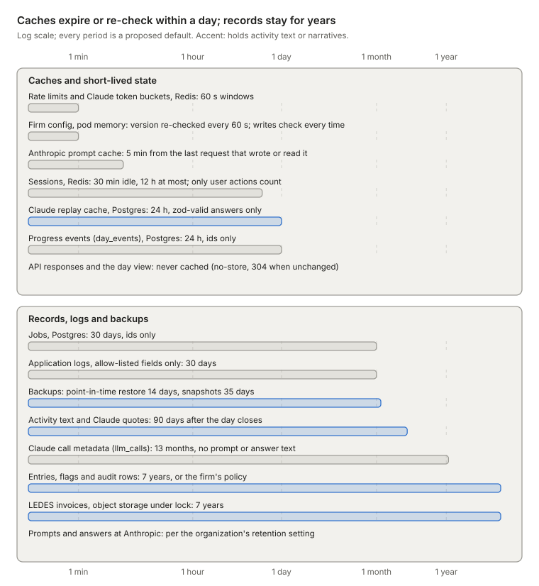

Caches expire or are re-checked within a day. Activity text is redacted 90 days after the day closes, while entries, audit rows and invoices stay 7 years. These are proposed defaults for each firm to set, not legal facts.

| Data | Where | Kept (proposed default) | How it ends |
| --- | --- | --- | --- |
| Activity text: email, calendar, document and call content, participants, Claude's quotes and suggestions | Postgres `activities` and `activity_matches`, under RLS, encrypted at rest | 90 days after the day closes (entries decided, queue empty), else 180 days after the work date | Text fields are redacted in place, skipping legal holds; one audit row per day records it |
| Activity skeletons and match decisions: times, seconds, matter, method, confidence | Postgres | As long as the entries they feed; skeletons that feed no entry expire with the text | Deleted with those entries |
| Time entries, sources, flags, day flags and the config versions they used | Postgres, written only by `service.ts` | 7 years after the invoice year, or the firm's policy | A retention job in `service.ts` deletes them per matter and year, with audit rows, unless a legal hold applies |
| `audit_events` | Postgres, partitioned by firm then month, with insert-only grants and both triggers; nightly per-firm hash roots in object-lock storage | 7 years, and never less than the records it explains | A two-person-approved owner job drops a firm's partitions only after that firm's retention and holds pass; rows are never edited |
| LEDES invoices | Object storage under object lock, plus the `exports` row: number, SHA-256, entry ids and versions, config version | 7 years | A lifecycle rule deletes the file once the lock ends; the row goes with the records purge |
| Claude replay cache | Postgres `llm_response_cache` | 24 h | Deleted hourly |
| Claude call metadata: purpose, model, prompt version, tokens including cache tokens, latency, stop reason | Postgres `llm_calls`, monthly partitions, no prompt or answer text | 13 months | Partitions are dropped; cost totals remain |
| Prompts and answers sent to Anthropic | Anthropic, under TimeDraft's organization | The organization's data-retention setting; prompt-cache entries last 5 min, or 1 h | ZDR is an organization or workspace setting. Fable-tier models require 30-day retention, so firms that need ZDR use a ZDR workspace and never a Fable-tier model. |
| Source credentials: per-attorney OAuth refresh tokens, delta-sync cursors and the replay-cache HMAC key | Tokens envelope-encrypted under a KMS key, under RLS, never logged; the HMAC key in KMS | Until the user is deprovisioned or the firm leaves | Revoked at the provider and deleted; rotating the HMAC key empties the replay cache |
| Operational state: jobs, `day_events`, sessions, rate counters | Postgres and Redis, ids only | Jobs 30 days, `day_events` 24 h, sessions 30 min idle or 12 h, counters 60 s | Deleted or expired |
| Backups and application logs | Encrypted snapshots and WAL archive; a log platform with allow-listed fields | Point-in-time restore 14 days, snapshots 35 days, logs 30 days | They expire on schedule. Purged rows survive in backups until then, which firm agreements must disclose. |

### A day with several users

1. **Sign in.** Attorney A and reviewer R at firm F sign in through F's OIDC provider. Every transaction they cause starts with `SET LOCAL app.firm_id` and `app.user_id`, so RLS limits it to F and to the matters they may see.
2. **Start.** A clicks Draft this day, or F's 19:00 scheduler fires. `POST /api/days/{id}/runs` returns the day's queued or running job and creates one only if there is none, so a double click, a second tab or a retry all get the same job. R's role cannot start runs.
3. **Watch.** A and R open the event stream on any SSE gateway pod. It replays `day_events` after `Last-Event-ID`, then follows `NOTIFY` with 15 s heartbeats. Events carry ids only, and each viewer loads details under its own RLS. Streams close after 30 min, so reconnects re-check access.
4. **Claim.** Worker W claims the job through a claim function that sees only a content-free queue table, skipping firms at their cap. It holds a 60 s lease with a fencing token, heartbeats every 15 s, sets `app.firm_id` and pins F's config version.
5. **Match.** Reconcile runs in code and commits with one `reconciled` audit row, and rules place the clear cases. The rest go through `client.ts` outside any transaction: replay check, token bucket, one Haiku 4.5 call, zod. One transaction then takes the day lock, checks the lease, re-reads staffing and walls, and writes the `decide()` results with one `matched` audit row. Low confidence, unverified quotes or a matter outside the roster mean `needs_review`.
6. **Draft.** Up to 4 matters at once call Sonnet 5.5 outside any transaction, reading the shared 5-minute prefix, with at most one repair each. Each matter commits alone under the day lock and a lease check: its entries, with tenths computed in code as `ceil(seconds / 360)`, one audit row per entry, one `drafted` row for what was left off the bill, and recomputed flags.
7. **Act during the run.** A edits E1 while R rejects E2 on the same day. Each request takes the day lock, then the entry lock with a version check (409 if stale), writes one audit row naming its user, recomputes flags and bumps `days.version`. It waits for one short commit at most, never for Claude.
8. **Finish or recover.** The last commit marks the day `drafted` and the job done, and sends `done`; viewers refetch with `If-None-Match`. If W crashes, its lease lapses after 60 s and another worker resumes from the committed stages, replaying logged answers. Transient errors back off 30 s × 2^n, capped at 30 min, for up to 8 attempts.

### Concurrency rules

- **One active run per day.** A run request returns the day's queued or running job and inserts only when there is none; two partial unique indexes back this up. Only the coalesced `draft_day` after a resolve may wait behind a running job.
- **One lock order.** The day row first (`UPDATE days SET version = version + 1`, which still lets ingest insert activities), then the job row, then the entry row `FOR UPDATE`.
- **Short transactions only.** No transaction spans a Claude call or an upload. Rewrite reads the entry, then calls Claude with no transaction open, and the attorney's save is an ordinary edit. `idle_in_transaction_session_timeout` is 10 s, and `lock_timeout` is 3 s for user actions.
- **Leases and fencing.** Leases last 60 s, with 15 s heartbeats on the database clock. Each stage commit updates its job row only where `lease_token` matches; zero rows means rollback.
- **Each change happens once.** A write, its one audit row and its `day_events` row commit together. Retries need no key store: entry actions carry versions, resolve checks status, run requests return the active job, and exports reuse a known request hash.
- **Cross-firm work runs under narrow roles.** Only the queue table sits outside tenant RLS, reached through a `SECURITY DEFINER` claim function. Purges and retention run under a maintenance role that sets `app.firm_id` for one firm at a time.
- **Fair sharing.** Each firm runs at most max(5, 10% of seats) jobs at once, and each worker allows 16 Claude calls in flight. Redis token buckets cap requests and tokens per minute at 80% of the organization's limit, and a 429 or 529 backs the job off.

### Scaling

- **Claude throughput binds first.** With 10,000 attorneys and half of them starting within two evening hours, expect about 0.7 runs/s and 5 Claude calls/s at 6 to 8 calls per run. The queue turns overload into waiting, so agree rate limits with Anthropic before onboarding large firms.
- **One Postgres primary is enough at that size.** That is about 3.5 million rows a day: about 350 per attorney-day, and 250 rows/s at peak. Partition `audit_events`, `llm_calls` and `day_events` from day one, add a read replica for history views, and split firms into cells past about 70% primary CPU.
- **Pods scale independently.** Web, SSE gateway and worker pods hold no state. Workers scale on the age of the oldest queued job (target under 60 s) and run 8 jobs and 16 Claude calls each.
- **Connections.** PgBouncer in transaction mode keeps about 100 server connections, and each gateway pod holds one direct `LISTEN` connection. To catch missed notifications, a gateway pod polls once every 5 s for all the days it streams, but only after its `LISTEN` connection reconnects or misses a heartbeat.
- **Per-day writes serialize.** That is harmless for 1 to 3 writers. With `go@1`, the check runs inside that lock for up to 2 s, so keep `ts@1` for writes and alert when checker p95 passes 200 ms.

### Open questions

- Which Anthropic rate limits does the evening peak need? The estimate is about 5 calls/s, mostly Sonnet 5.5, at 10,000 attorneys.
- Which firms require ZDR? Their calls need a ZDR workspace, with its own prompt cache, and never a Fable-tier model.
- Does block 1 stay above 512 tokens once its examples are generic, and does a rewrite read the block a draft wrote? Check `usage.cache_read_input_tokens` on the dev eval.
- Should billed entries stay locked, with corrections as adjustment entries on a later invoice?
- Should reviewers see source activity text in Why this entry, or only entries, flags and times?
- Will each firm's counsel accept the proposed defaults: 90 days for activity text, 24 h for replay, 13 months for metadata, 7 years for records?
- Does sending only the roster, with one match schema for all firms, keep auto precision? Re-score the dev split, then the holdout once; oracle numbers never count.
- Is an overnight Message Batches lane worth adding? Check its pricing, latency and ZDR eligibility first.

## Glossary

| Term | Meaning |
| --- | --- |
| Activity | One email, calendar event, document session or phone call from the day, stored in `activities` |
| Matter | A client case, such as `M-1002` Halberd v. Ostrander |
| Tenth | 0.1 hour, or 6 minutes: the billing unit, stored as the integer `units_tenths` |
| Narrative | The entry's one-line description of the work |
| UTBMS codes | Standard litigation codes: task codes such as `L310` Written Discovery, and activity codes such as `A103` Draft/revise |
| LEDES 1998B | A pipe-delimited e-billing file format that clients' billing systems import |
| Profile | A client's guideline limits; TimeDraft has `default` and `strict` |
| Flag | A guideline finding on an entry. A `block` flag stops approval without a reason; a `warn` flag does not |
| Override reason | The attorney's reason for approving an entry despite a `block` flag |
| Block billing | Several different tasks lumped into one entry |
| Thin | The drafter's mark that the sources don't say what the work was for |
| Review queue | Activities waiting for the attorney to pick a matter ("Needs a matter") |
| Shared contact | A person who works on more than one matter, such as an expert |
| Answer key | A day's expected matches, entries and codes, used to score the pipeline |
| Trap | A planted hard case in a synthetic day, such as a duplicate call or a shared expert |
| Dev and holdout | Days 01 to 08 are for tuning; days 09 to 12 are meant to be scored once, at the end (nothing enforces it) |
| Oracle | An answer-key stand-in for Claude, for tests only |
